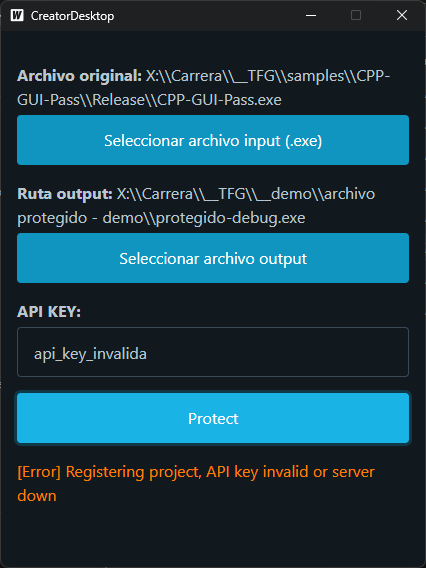

# Creator-GUI

  

Lo que verá el cliente será una sencilla e intuitiva aplicación de escritorio con una moderna interfaz gráfica, como la que se puede ver arriba. Esta aplicación ha sido desarrollada utilizando un framework llamado [Wails](https://wails.io/), que permite combinar un frontend desarrollado en tecnologías web, junto con un backend desarrollado en [Golang](https://go.dev/). Para el desarrollo de la parte del frontend, he decidido utilizar un framework web llamado [PreactJS](https://preactjs.com/), que me permite desarrollar de una manera más sencilla y robusta que hacerlo directamente con HTML, CSS y Javascript, pero manteniendo la ligereza. Por otra parte, el backend ha sido desarrollado en Golang. Se trata de un backend muy sencillo, en el que se producen únicamente tres eventos: seleccionar el archivo de input, seleccionar la ruta de output y, finalmente, ejecutar el programa Creator con los parámetros especificados, siendo los parámetros especificados, el archivo de input previamente seleccionado, la ruta de output también previamente seleccionada y por último la key de la API como método de autenticación a la API.

Al ejecutar el programa Creator, debemos tener el archivo creator.exe en el mismo directorio que la aplicación de escritorio. Después de acabar con la ejecución, el programa Creator devuelve un status code y, según el código que devuelva, la interfaz emitirá un mensaje de feedback u otro.
